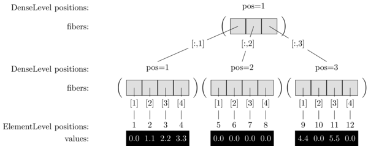
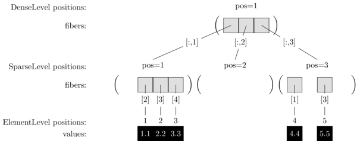
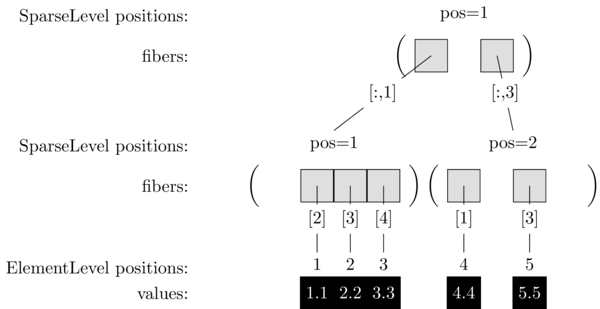

```@meta
CurrentModule = Finch
```
# Level Formats

Finch implements a flexible array datastructure called a fiber. Fibers represent
arrays as rooted trees, where the child of each node is selected by an array
index. Finch is column major, so in an expression `A[i_1, ..., i_N]`, the
rightmost dimension `i_N` corresponds to the root level of the tree, and the
leftmost dimension `i_1` corresponds to the leaf level. When the array is dense,
the leftmost dimension has stop 1. We can convert the matrix `A` to a fiber
with the `@fiber` constructor:

```jldoctest example1; setup=:(using Finch)
julia> A = [0.0 0.0 4.4; 1.1 0.0 0.0; 2.2 0.0 5.5; 3.3 0.0 0.0]
4×3 Matrix{Float64}:
 0.0  0.0  4.4
 1.1  0.0  0.0
 2.2  0.0  5.5
 3.3  0.0  0.0
julia> A_fbr = @fiber(d(d(e(0.0))), A)
Dense [:,1:3]
├─[:,1]: Dense [1:4]
│ ├─[1]: 0.0
│ ├─[2]: 1.1
│ ├─[3]: 2.2
│ ├─[4]: 3.3
├─[:,2]: Dense [1:4]
│ ├─[1]: 0.0
│ ├─[2]: 0.0
│ ├─[3]: 0.0
│ ├─[4]: 0.0
├─[:,3]: Dense [1:4]
│ ├─[1]: 4.4
│ ├─[2]: 0.0
│ ├─[3]: 5.5
│ ├─[4]: 0.0
```

We refer to a node in the tree as a subfiber. All of the nodes at the same level
are stored in the same datastructure, and disambiguated by an integer
`position`.  In the above example, there are three levels: The rootmost level
contains only one fiber, the root. The middle level has 3 subfibers, one for
each column. The leafmost level has 12 subfibers, one for each element of the
array.  For example, the first level is `A_fbr.lvl`, and we can represent it's
third position as `SubFiber(A_fbr.lvl.lvl, 3)`. The second level is `A_fbr.lvl.lvl`,
and we can access it's 9th position as `SubFiber(A_fbr.lvl.lvl.lvl, 9)`. For
instructional purposes, you can use parentheses to call a fiber on an index to
select among children of a fiber.

```jldoctest example1
julia> Finch.SubFiber(A_fbr.lvl.lvl, 3)
Dense [1:4]
├─[1]: 4.4
├─[2]: 0.0
├─[3]: 5.5
├─[4]: 0.0

julia> A_fbr[:, 3]
Dense [1:4]
├─[1]: 4.4
├─[2]: 0.0
├─[3]: 5.5
├─[4]: 0.0

julia> A_fbr(3)
Dense [1:4]
├─[1]: 4.4
├─[2]: 0.0
├─[3]: 5.5
├─[4]: 0.0

julia> Finch.SubFiber(A_fbr.lvl.lvl.lvl, 9)
4.4

julia> A_fbr[1, 3]
4.4

julia> A_fbr(3)(1)
4.4

```

When we print the tree in text, positions are numbered from top to bottom.
However, if we visualize our tree with the root at the top, positions range from
left to right:



Because our array is sparse, (mostly zero, or another fill value), it would be
more efficient to store only the nonzero values. In Finch, each level is
represented with a different format. A sparse level only stores non-fill values.
This time, we'll use a fiber constructor with `sl` (for "`SparseList` of
nonzeros") instead of `d` (for "`Dense`"):

```jldoctest example1
julia> A_fbr = @fiber(d(sl(e(0.0))), A)
Dense [:,1:3]
├─[:,1]: SparseList (0.0) [1:4]
│ ├─[2]: 1.1
│ ├─[3]: 2.2
│ ├─[4]: 3.3
├─[:,2]: SparseList (0.0) [1:4]
├─[:,3]: SparseList (0.0) [1:4]
│ ├─[1]: 4.4
│ ├─[3]: 5.5
```



Our `d(sl(e(0.0)))` format is also known as
["CSC"](https://en.wikipedia.org/wiki/Sparse_matrix#Compressed_sparse_column_.28CSC_or_CCS.29)
and is equivalent to
[`SparseMatrixCSC`](https://sparsearrays.juliasparse.org/dev/#man-csc). The
[`fiber!`](@ref) function will perform a zero-cost copy between Finch fibers and
sparse matrices, when available.  CSC is an excellent general-purpose
representation when we expect most of the columns to have a few nonzeros.
However, when most of the columns are entirely fill (a situation known as
hypersparsity), it is better to compress the root level as well:

```jldoctest example1
julia> A_fbr = @fiber(sl(sl(e(0.0))), A)
SparseList (0.0) [:,1:3]
├─[:,1]: SparseList (0.0) [1:4]
│ ├─[2]: 1.1
│ ├─[3]: 2.2
│ ├─[4]: 3.3
├─[:,3]: SparseList (0.0) [1:4]
│ ├─[1]: 4.4
│ ├─[3]: 5.5
```



Here we see that the entirely zero column has also been compressed. The
`sl(sl(e(0.0)))` format is also known as
["DCSC"](https://ieeexplore.ieee.org/document/4536313).

The
["COO"](https://docs.scipy.org/doc/scipy/reference/generated/scipy.sparse.coo_matrix.html)
(or "Coordinate") format is often used in practice for ease of interchange
between libraries. In an `N`-dimensional array `A`, COO stores `N` lists of
indices `I_1, ..., I_N` where `A[I_1[p], ..., I_N[p]]` is the `p`^th stored
value in column-major numbering. In Finch, `COO` is represented as a multi-index
level, which can handle more than one index at once. We use curly brackets to
declare the number of indices handled by the level:

```jldoctest example1
julia> A_fbr = @fiber(sc{2}(e(0.0)), A)
SparseCOO (0.0) [1:4,1:3]
├─├─[2, 1]: 1.1
├─├─[3, 1]: 2.2
├─├─[4, 1]: 3.3
├─├─[1, 3]: 4.4
├─├─[3, 3]: 5.5
```


The COO format is compact and straightforward, but doesn't support random
access. For random access, one should use the `SparseHash` format. A full listing
of supported formats is described below:

# Public Functions

### Fiber Constructors

```@docs
@fiber
fiber
fiber!
fiber_abbrev
```

### Level Constructors

```@docs
DenseLevel
ElementLevel
SparseListLevel
SparseCOOLevel
SparseHashLevel
```